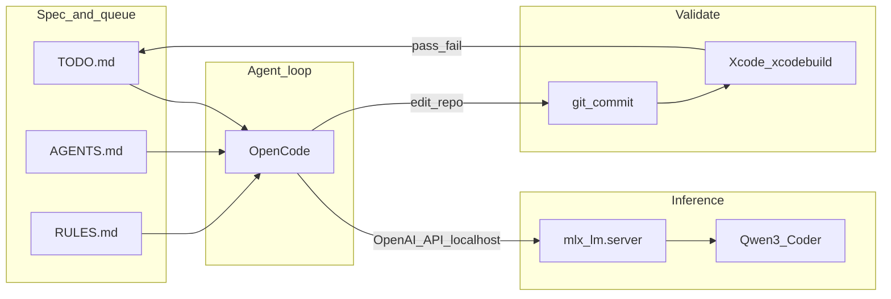

# Local agent workflow (MLX + OpenCode)

How to implement [TODO.md](../TODO.md) tasks using a **local MLX + Qwen3 Coder** server and **OpenCode** as the agent loop, with **Xcode** for build/run and **Cursor** optional for review.

Full agent rules remain in [AGENTS.md](../AGENTS.md). This doc covers **role split**, **per-session sequence**, **context packs**, and **transition** from cloud IDE agents.

---

## Overview



| Role | Tool | Responsibility |
|------|------|----------------|
| Spec and queue | `TODO.md`, `AGENTS.md`, `RULES.md` | One task at a time; outcome and validation; no scope creep |
| Inference | `mlx_lm.server` + Qwen3 Coder (MLX) | Reasoning and code generation; no direct repo access |
| Agent loop | **OpenCode** | Read/write repo, run shell (`xcodebuild`), apply edits |
| IDE and verify | **Xcode** | Build, run, debug the macOS app |
| Review (optional) | **Cursor** | Diff review and navigation—not the primary implementer |

MLX alone does not replace an agent. OpenCode (or similar) calls `http://127.0.0.1:8080/v1` and uses tools to change files.

---

## Per-session sequence

Run these steps for **each** unchecked item under `TODO.md` → **Now**.

1. **Select task** — Take the first unchecked **Now** item. Confirm every **Depends on** task is already in **Done**.
2. **Start inference** — Activate your MLX venv and run the local server (see [MLX + Qwen3 setup](#mlx--qwen3-setup)).
3. **Configure OpenCode** — Point your provider at `http://127.0.0.1:8080/v1` (config stays in your home directory, not in this repo).
4. **Build context pack** — Fill `docs/agent-packs/current-task.md` from [context tiers](#context-pack-tiers) using [agent-context-pack-template.md](agent-context-pack-template.md).
5. **Run OpenCode** — One task only; follow [AGENTS.md](../AGENTS.md); use the [prompt template](#opencode-prompt-template) and attach or reference the context pack.
6. **Validate** — Run the task **Validation** line (`xcodebuild`, XCTest, manual steps). Fix until pass or log in `TODO.md` → **Bugs**.
7. **Close loop** — Check off the task, update **Done**, write the [completion report](../AGENTS.md#completion-report-format), commit on your `cursor/…` branch.
8. **Next session** — New context pack; do not rely on a long prior chat.

---

## MLX + Qwen3 setup

### Install (one-time)

```bash
python3 -m venv ~/mlx-env
source ~/mlx-env/bin/activate
pip install mlx-lm
```

### Model

A common choice on Apple Silicon with enough unified memory (often 32GB+ for 8-bit MoE):

- `mlx-community/Qwen3-Coder-30B-A3B-Instruct-8bit` (MoE: ~3B active parameters per token)

For tighter RAM, use a 4-bit variant and/or a smaller coder model from the MLX community on Hugging Face.

Optional: download to a local directory so you can patch config without touching the HF cache:

```bash
# Example — adjust paths and model id as needed
huggingface-cli download mlx-community/Qwen3-Coder-30B-A3B-Instruct-8bit \
  --local-dir ~/models/qwen3-coder-30b-8bit
```

If **tool calling** fails (model emits XML but the server does not parse tools), add to the top level of `tokenizer_config.json` in your local model copy:

```json
"tool_parser_type": "qwen3_coder"
```

### Run server

```bash
source ~/mlx-env/bin/activate
mlx_lm.server \
  --model ~/models/qwen3-coder-30b-8bit \
  --host 127.0.0.1 \
  --port 8080
```

Verify the server is up (exact endpoint may vary by `mlx-lm` version; chat completions should be under `/v1/`).

### Caveats

- Large models and long context can spike unified memory; watch Activity Monitor.
- Prefer **one TODO per session** and bounded context packs.
- Keep Ollama or a smaller model as fallback if you hit OOM or kernel pressure on long agent runs.

---

## OpenCode setup

OpenCode is the standardized **agent loop** for this repo. Official docs: [opencode.ai](https://opencode.ai).

1. Install OpenCode per upstream instructions.
2. Add a provider that uses the **OpenAI-compatible** API.
3. Set `baseURL` to `http://127.0.0.1:8080/v1` (or your MLX server port).
4. Set `apiKey` to a placeholder (e.g. `not-needed`) if the client requires one.
5. Register the model name your server exposes (often the Hugging Face repo id or a served alias).
6. Enable **tools** / agent mode so OpenCode can edit files and run commands.

Do **not** commit `opencode.json` (or similar) into this repository unless the team explicitly decides to share a template later. Keep machine-specific config under your home directory.

Conceptual provider shape:

```json
{
  "provider": {
    "mlx": {
      "options": {
        "baseURL": "http://127.0.0.1:8080/v1"
      },
      "models": {
        "<your-served-model-id>": {
          "tools": { "task": true }
        }
      }
    }
  }
}
```

Adjust keys to match your OpenCode version and config schema.

---

## Context pack tiers

Build `docs/agent-packs/current-task.md` each session (gitignored). See [agent-context-pack-template.md](agent-context-pack-template.md).

### Always include

- [RULES.md](../RULES.md) (or a short paste of its execution bullets)
- The **exact** TODO block: Outcome, Depends on, Validation, Notes
- Current git branch name
- Instruction footer: one task only; no **Later** / **Blocked**; follow AGENTS completion report

### Usually include (by task type)

| Task area | Include excerpt from |
|-----------|----------------------|
| Xcode project / folders | [ARCHITECTURE.md](../ARCHITECTURE.md) §6 (folder structure) |
| Core Data | [ARCHITECTURE.md](../ARCHITECTURE.md) §4 (data model) |
| Parser | [SPEC.md](../SPEC.md) relevant requirements + `docs/parser-rules.md` when it exists |
| Sync / Reminders | [ARCHITECTURE.md](../ARCHITECTURE.md) §7 (interfaces), §8 (security) |
| MVP sign-off | [SPEC.md](../SPEC.md) acceptance criteria (snippet only) |

### After Swift code exists

- Paths and contents for **touched modules only** (e.g. `Persistence/`, relevant `Tests/`), not the entire tree.

### Do not dump by default

- Full [PLAN.md](../PLAN.md) or [IDEAS.md](../IDEAS.md)
- If over context budget, drop PLAN first; never drop the active TODO block or Validation.

---

## OpenCode prompt template

Copy and fill before each session:

```markdown
Implement exactly ONE task for the Flownote macOS app repo.

Context: docs/agent-packs/current-task.md (attached or pasted below).

Rules:
- Follow AGENTS.md and RULES.md.
- Do not start Later or Blocked tasks.
- Do not invent features outside SPEC.md MVP.
- Touch only files required for this task.
- macOS 14+, SwiftUI, Core Data per ARCHITECTURE.md (not SwiftData unless decided in OPEN_QUESTIONS.md).

When done:
1. List files changed.
2. Commands run (especially xcodebuild / xcodebuild test).
3. Pass/fail for task Validation.
4. Text for TODO.md (checkbox + Done entry).
5. Completion report per AGENTS.md.
```

---

## Validation matrix

Map TODO **Validation** lines to concrete checks:

| Validation phrase | Typical command / action |
|-------------------|---------------------------|
| Xcode build succeeds | `xcodebuild -scheme Flownote -destination 'platform=macOS' build` (adjust scheme after project exists) |
| App runs locally | Run from Xcode or `open` built `.app` |
| Cmd+U passes | `xcodebuild test` with unit/integration scheme |
| Manual typing / launch | Human check in Xcode |
| Rules reviewed against SPEC | Human diff of `docs/parser-rules.md` |
| Integration test | XCTest integration target |
| Reminders spike | Run on device/simulator with permission; document in `docs/reminders-spike.md` |

Record skipped checks and why in the completion report (no Mac, no signing team, server down, etc.).

---

## Cursor vs OpenCode

| Use OpenCode + MLX | Use Cursor (optional) |
|--------------------|------------------------|
| Implementing TODO **Now** items | Reviewing diffs and architecture questions |
| Repetitive Swift/tests/docs | Occasional complex refactor review |
| Staying on local Qwen3 Coder | Inline edit with cloud model when local quality is insufficient |

Cursor is not the source of truth for **what** to build—`TODO.md` is.

---

## Transition phases (Cursor to local)

| Phase | State |
|-------|--------|
| **A** | Planning docs on `main` — **done** |
| **B** | MLX server + OpenCode as default implementer on `cursor/xcode-scaffold` (or successor branch) |
| **C** | Cursor = IDE + review; optional custom model pointing at `localhost:8080` for small edits |
| **D** | Git + `TODO.md` updated every session |
| **E** | CI on push (see TODO **Later**) |

### Hybrid: first Xcode task

The first **Now** task (“Create Xcode macOS app project”) is often fastest if you create the macOS App target once in **Xcode** (SwiftUI, macOS 14), then use OpenCode for scaffolding folders, Swift, and tests in follow-up tasks.

---

## Troubleshooting

| Symptom | Things to try |
|---------|----------------|
| Connection refused on :8080 | Start `mlx_lm.server`; confirm host/port match OpenCode `baseURL` |
| Tool calls not working | Set `tool_parser_type` to `qwen3_coder` in local `tokenizer_config.json` |
| Slow or OOM | Smaller/4-bit model; shorter context pack; one task per session |
| `xcodebuild` fails signing | Select Development team in Xcode; “Sign to Run Locally” |
| OpenCode edits wrong files | Narrow context pack; repeat “one task only” in prompt |
| Quality too low for SwiftUI | Use Cursor/cloud for review; keep TODO queue in git |

---

## Related files

- [AGENTS.md](../AGENTS.md) — canonical agent manual
- [RULES.md](../RULES.md) — short checklist
- [agent-context-pack-template.md](agent-context-pack-template.md) — per-session pack template
- Ephemeral packs: `docs/agent-packs/current-task.md` (gitignored)
